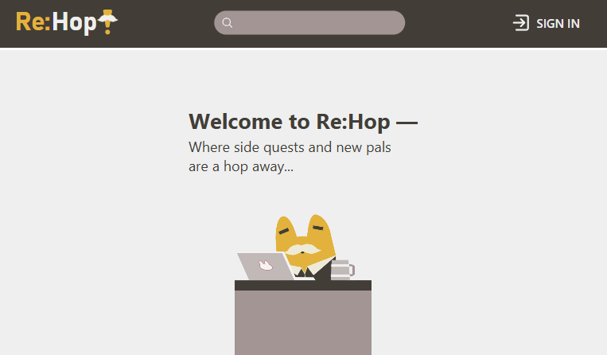
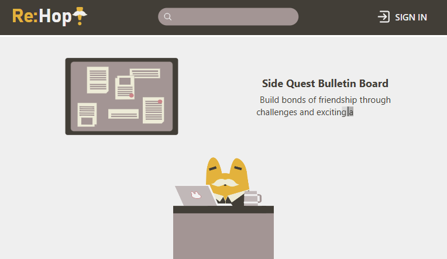
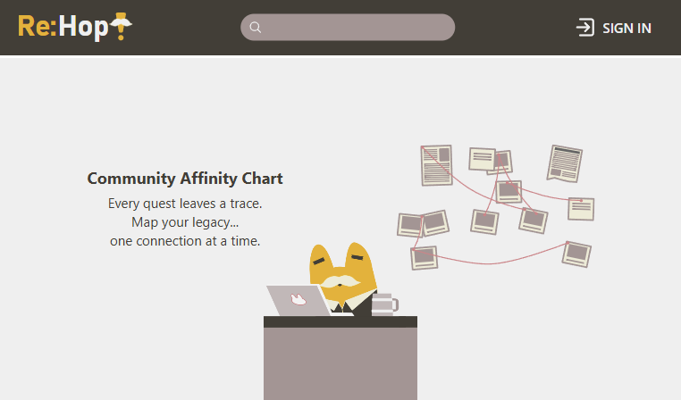
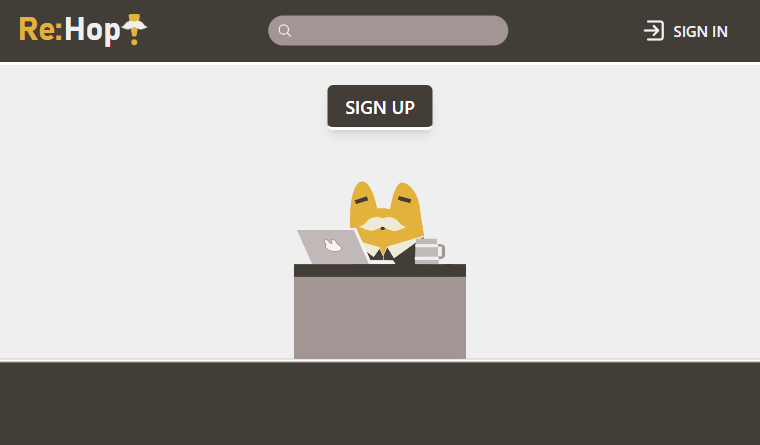

# Re:Hop – Landing Page 

A conceptual landing page for a hypothetical social networking app built around side quests community interaction and an office frog mascot.

## Project Goals

The main goals of this project were:

- To explore **Framer Motion** for a custom typewriter-like text rendering effect.
- To experiment with **Lottie** for lightweight, vector-based animations.
- To deploy a sleek landing experience that reflects the app’s quirky personality.

## 🛠 Tech Stack

- **React**
- **TailwindCSS**
- **Framer Motion**
- **LottieFiles** (`@lottiefiles/dotlottie-react`) for vector animations

## 🌐 Demo

[Live Site](https://jelemy.github.io/rehop-landing)

## 📸 Screenshots

  
  
  
  

---